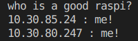

# raspi-discovery-protocol

That's right. This protocol discovers with love and flooding your raspis in the local network. ♥

## Setup

requirements: python

### Raspi

`sh setup.sh`

### Discovery

`python pi_signal.py`
